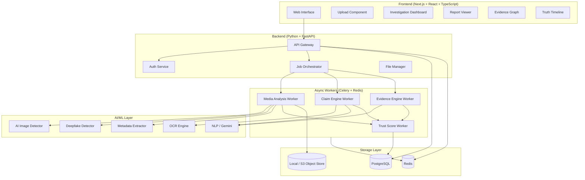

# TrustGraph — Phase 1 MVP Implementation Plan

Build the **Digital Trust Platform** (Phase 1: Web Platform + Core Verification Engine) as defined in the [master.md](file:///c:/Users/Asus/Documents/master.md) spec.

## User Review Required

> [!IMPORTANT]
> **Scope Decision**: This plan covers the full Phase 1 MVP as described in the master document. The workspace at [TrueNewsAI](file:///c:/vaibhav_program/TrueNewsAI) is currently empty — we'll be building from scratch.

> [!WARNING]
> **API Keys Required**: Several services require API keys that you'll need to provide before the system is functional:
> - **Google Gemini API Key** — for claim extraction, evidence analysis, and NLP (used via `google-generativeai` Python SDK)
> - **Google Custom Search API Key + CX ID** — for evidence retrieval and reverse image search
> - **Optional**: SerpAPI key as a fallback for web search
>
> These should be set in a `.env` file that we'll create. The app will gracefully degrade if keys are missing.

> [!IMPORTANT]
> **AI Model Strategy**: For the MVP, we'll use pre-trained open-source models (no training required):
> - **Deepfake/AI-image detection**: `umm-maybe/AI-image-detector` (HuggingFace ViT-based)
> - **Face detection**: MTCNN / MediaPipe
> - **NLP/Claim extraction**: Google Gemini API (structured prompting)
> - **OCR**: Tesseract OCR
> - **Video analysis**: FFmpeg + frame sampling + per-frame image analysis
>
> This avoids needing GPUs or custom training for the hackathon.

## Open Questions

1. **Authentication**: Should we implement full user registration (email/password + OAuth) or start with a simpler approach (e.g., anonymous usage with optional login)?
2. **Hosting**: Are you planning to deploy this during the hackathon? If so, what's the target platform (Vercel + Railway? Docker Compose on a VM? Local only?)
3. **Telegram Bot**: The master doc says Telegram is out of Phase 1 scope, but your initial message mentions it as part of the hackathon MVP. Should we include a basic Telegram bot in this build?
4. **Database**: The spec recommends PostgreSQL. For faster hackathon iteration, we could use SQLite initially and migrate later. Preference?

---

## Proposed Architecture



---

## Proposed Changes

### Component 1: Project Foundation & Configuration

#### [NEW] Project root configuration files

| File | Purpose |
|------|---------|
| [`.env.example`](file:///c:/vaibhav_program/TrueNewsAI/.env.example) | Environment variables template |
| [`docker-compose.yml`](file:///c:/vaibhav_program/TrueNewsAI/docker-compose.yml) | Local dev orchestration (backend, frontend, Redis, PostgreSQL) |
| [`README.md`](file:///c:/vaibhav_program/TrueNewsAI/README.md) | Project overview, setup instructions |
| [`.gitignore`](file:///c:/vaibhav_program/TrueNewsAI/.gitignore) | Ignore patterns |

---

### Component 2: Backend (Python + FastAPI)

Directory: `backend/`

#### [NEW] Core Backend Structure

```
backend/
├── main.py                    # FastAPI app entry point
├── config.py                  # Settings & env config
├── requirements.txt           # Python dependencies
├── Dockerfile                 # Backend container
├── api/
│   ├── __init__.py
│   ├── routes/
│   │   ├── __init__.py
│   │   ├── investigations.py  # POST/GET/DELETE investigations
│   │   ├── auth.py            # Registration, login, token refresh
│   │   ├── health.py          # Health check endpoint
│   │   └── admin.py           # Admin dashboard APIs
│   ├── dependencies.py        # Auth deps, DB session
│   └── schemas.py             # Pydantic request/response models
├── models/
│   ├── __init__.py
│   ├── user.py                # User ORM model
│   ├── investigation.py       # Investigation, File, Verdict models
│   ├── claim.py               # Claim, Evidence models
│   ├── score.py               # Score, ModelRun models
│   └── report.py              # Report model
├── services/
│   ├── __init__.py
│   ├── investigation_service.py  # Business logic for investigations
│   ├── file_service.py           # File upload, validation, storage
│   ├── auth_service.py           # JWT, password hashing
│   └── report_service.py         # Report generation (JSON, PDF)
├── workers/
│   ├── __init__.py
│   ├── celery_app.py           # Celery configuration
│   ├── media_worker.py         # Orchestrate media analysis
│   ├── claim_worker.py         # Claim extraction & verification
│   ├── evidence_worker.py      # Evidence retrieval & ranking
│   └── trust_worker.py         # Trust score computation
├── trust_engine/
│   ├── __init__.py
│   ├── scorer.py               # Multi-dimensional scoring logic
│   ├── verdict.py              # Verdict determination rules
│   └── explainer.py            # Human-readable explanation generation
├── evidence_engine/
│   ├── __init__.py
│   ├── web_search.py           # Google Custom Search / SerpAPI
│   ├── reverse_image.py        # Reverse image search for origin
│   ├── evidence_ranker.py      # Score and rank evidence
│   └── origin_tracker.py       # Find earliest appearances
├── database/
│   ├── __init__.py
│   ├── session.py              # SQLAlchemy async session
│   └── migrations/             # Alembic migrations
└── utils/
    ├── __init__.py
    ├── hashing.py              # Content hashing (SHA-256)
    ├── file_validators.py      # File type, size, security checks
    └── responsible_ai.py       # Language templates for verdicts
```

#### Key Design Decisions

- **Async FastAPI** with SQLAlchemy async for non-blocking DB access
- **Celery + Redis** for background investigation processing
- **JWT authentication** with access/refresh token pairs
- **Responsible AI module** (`responsible_ai.py`) — all user-facing verdict text goes through templates that avoid absolute language, per the spec's Section 9.3 and 30

---

### Component 3: AI/ML Layer

Directory: `ml/`

#### [NEW] ML Pipeline Structure

```
ml/
├── __init__.py
├── image/
│   ├── __init__.py
│   ├── ai_detector.py         # HuggingFace ViT AI-image classifier
│   ├── manipulation.py        # ELA (Error Level Analysis) + noise analysis
│   ├── metadata.py            # EXIF extraction & anomaly detection
│   └── face_analysis.py       # Face detection (MTCNN/MediaPipe)
├── video/
│   ├── __init__.py
│   ├── extractor.py           # FFmpeg keyframe/frame sampling
│   ├── deepfake.py            # Per-frame deepfake analysis
│   ├── temporal.py            # Temporal consistency checks
│   └── audio_extract.py       # Audio track extraction
├── audio/
│   ├── __init__.py
│   └── analyzer.py            # Placeholder for Phase 2
├── nlp/
│   ├── __init__.py
│   ├── ocr.py                 # Tesseract OCR wrapper
│   ├── claim_extractor.py     # Gemini-powered claim extraction
│   ├── claim_verifier.py      # Evidence-based claim verification
│   └── language_detector.py   # Language detection
└── evaluation/
    ├── __init__.py
    └── benchmarks.py           # Evaluation metrics tracking
```

#### AI Models Used (all pre-trained, no training needed)

| Task | Model/Tool | Source |
|------|-----------|--------|
| AI-image detection | `umm-maybe/AI-image-detector` | HuggingFace (ViT) |
| Manipulation detection | Custom ELA + noise analysis | OpenCV |
| Face detection | MTCNN | facenet-pytorch |
| Metadata extraction | Pillow + ExifRead | Built-in |
| OCR | Tesseract | pytesseract |
| Claim extraction | Google Gemini 1.5 Flash | google-generativeai |
| Evidence analysis | Google Gemini 1.5 Flash | google-generativeai |
| Video frames | FFmpeg | ffmpeg-python |
| Deepfake (video) | Frame-level AI-image analysis | Same ViT model |

---

### Component 4: Frontend (Next.js + React + TypeScript)

Directory: `frontend/`

#### [NEW] Frontend Structure

```
frontend/
├── package.json
├── next.config.js
├── tsconfig.json
├── Dockerfile
├── tailwind.config.ts
├── app/
│   ├── layout.tsx              # Root layout with fonts, theme
│   ├── page.tsx                # Landing page (hero + upload)
│   ├── globals.css             # Global styles + design tokens
│   ├── investigate/
│   │   └── [id]/
│   │       └── page.tsx        # Investigation result page
│   ├── dashboard/
│   │   └── page.tsx            # User investigation history
│   ├── login/
│   │   └── page.tsx            # Auth page
│   └── admin/
│       └── page.tsx            # Admin dashboard
├── components/
│   ├── ui/                     # shadcn/ui components
│   ├── upload/
│   │   ├── DropZone.tsx        # Drag-and-drop file upload
│   │   ├── URLInput.tsx        # URL submission
│   │   └── UploadProgress.tsx  # Upload + processing progress
│   ├── report/
│   │   ├── TrustScore.tsx      # Animated trust score gauge
│   │   ├── VerdictBadge.tsx    # Color-coded verdict display
│   │   ├── ScoreDimensions.tsx # Radar chart of 5 dimensions
│   │   ├── FindingsList.tsx    # Evidence findings cards
│   │   ├── EvidenceGraph.tsx   # React Flow evidence graph
│   │   └── TruthTimeline.tsx   # Chronological evidence timeline
│   ├── layout/
│   │   ├── Navbar.tsx          # Navigation bar
│   │   ├── Footer.tsx          # Footer
│   │   └── Sidebar.tsx         # Dashboard sidebar
│   └── common/
│       ├── LoadingSpinner.tsx
│       ├── ErrorBoundary.tsx
│       └── ConfidenceBar.tsx   # Shows uncertainty levels
├── services/
│   ├── api.ts                  # Axios/fetch API client
│   ├── auth.ts                 # Auth token management
│   └── websocket.ts            # Real-time investigation updates
├── hooks/
│   ├── useInvestigation.ts
│   └── useAuth.ts
└── lib/
    └── utils.ts
```

#### UI/UX Design Approach

- **Dark mode primary** with glassmorphism cards
- **Animated trust score gauge** (0-100, color-graded green→yellow→orange→red)
- **Evidence Graph** using React Flow with interactive nodes
- **Truth Timeline** as a vertical stepper with evidence cards
- **Radar chart** for the 5 trust dimensions
- **Responsible AI language** — all verdicts use hedged, evidence-based phrasing

---

### Component 5: Database Schema

#### [NEW] PostgreSQL schema via SQLAlchemy + Alembic

Core tables matching spec Section 5.5:

| Table | Key Columns |
|-------|-------------|
| `users` | id, email, password_hash, role, created_at |
| `investigations` | id, user_id, input_type, input_hash, status, verdict, trust_score, created_at |
| `files` | id, investigation_id, filename, file_type, file_size, storage_path, content_hash |
| `media_analysis` | id, investigation_id, file_id, analysis_type, result_json, confidence, model_name, model_version |
| `claims` | id, investigation_id, claim_text, source_text, verdict, confidence |
| `evidence` | id, investigation_id, claim_id, source_url, source_type, role (supporting/contradicting/contextual/origin), relevance_score, publication_date |
| `scores` | id, investigation_id, media_authenticity, claim_credibility, context_accuracy, source_reliability, evidence_strength, overall_trust |
| `verdicts` | id, investigation_id, verdict_category, explanation, evidence_summary |
| `reports` | id, investigation_id, report_json, report_html, created_at |
| `model_runs` | id, investigation_id, model_name, model_version, input_hash, confidence, processing_time_ms |
| `audit_logs` | id, user_id, action, details, timestamp |

---

### Component 6: API Endpoints

Matching spec Section 5.6 + additional auth endpoints:

| Method | Endpoint | Purpose |
|--------|----------|---------|
| POST | `/api/v1/auth/register` | User registration |
| POST | `/api/v1/auth/login` | Login, returns JWT |
| POST | `/api/v1/auth/refresh` | Refresh token |
| POST | `/api/v1/investigations` | Create investigation (upload file or URL) |
| POST | `/api/v1/investigations/{id}/content` | Attach additional content |
| GET | `/api/v1/investigations/{id}` | Get investigation status + summary |
| GET | `/api/v1/investigations/{id}/evidence` | Get evidence details |
| GET | `/api/v1/investigations/{id}/report` | Get full report |
| DELETE | `/api/v1/investigations/{id}` | Delete investigation + files |
| GET | `/api/v1/investigations` | List user's investigations |
| GET | `/api/v1/health` | Health check |
| GET | `/api/v1/admin/stats` | Admin system stats |

---

## Sprint Execution Plan

### Sprint 1: Foundation (Files: ~25)
- Project scaffolding (both frontend and backend)
- Docker Compose setup (PostgreSQL, Redis, backend, frontend)
- Database models + Alembic migration
- Auth system (register, login, JWT)
- File upload + validation service
- Basic frontend: landing page, auth pages, upload component
- Health check endpoint

### Sprint 2: Image Verification (Files: ~15)
- AI-image detection pipeline (ViT model)
- ELA manipulation analysis
- EXIF metadata extraction
- Face detection
- Media analysis worker (Celery)
- Frontend: investigation progress, basic result display

### Sprint 3: Claim Verification (Files: ~10)
- OCR integration (Tesseract)
- Gemini-powered claim extraction
- Google Custom Search evidence retrieval
- Evidence ranking
- Claim verification worker

### Sprint 4: Video Analysis (Files: ~8)
- FFmpeg keyframe extraction
- Per-frame deepfake analysis
- Temporal consistency
- Audio extraction
- Video analysis worker

### Sprint 5: Trust Engine & Reports (Files: ~12)
- Multi-dimensional scoring logic
- Verdict determination rules
- Responsible AI explanation generation
- Report generation (JSON + web)
- Trust score UI (gauge, radar chart, dimensions)

### Sprint 6: Evidence Intelligence & UX Polish (Files: ~10)
- Reverse image search / origin detection
- Evidence Graph (React Flow)
- Truth Timeline component
- Investigation dashboard / history
- Challenge My Verdict UI
- Final UI polish, animations, dark mode refinement

---

## Verification Plan

### Automated Tests
```bash
# Backend unit tests
cd backend && pytest tests/ -v --cov=.

# Frontend tests
cd frontend && npm test

# API integration tests
cd backend && pytest tests/integration/ -v

# Lint checks
cd backend && ruff check .
cd frontend && npm run lint
```

### Manual Verification
- Upload test images (real photos, AI-generated images, manipulated photos)
- Submit URLs with known misinformation
- Verify trust scores align with expected verdicts (the 6 benchmark cases from Section 10.3)
- Check that all verdict language follows Responsible AI guidelines
- Test the full flow: upload → processing → report → evidence graph
- Verify responsive design on desktop, tablet, mobile

### AI/ML Evaluation
- Run against a curated test set of ~50 images (mix of real, AI-generated, manipulated)
- Measure precision, recall, F1 for AI-image detection
- Verify claim extraction produces sensible claims from test captions
- Check that evidence retrieval returns relevant results
